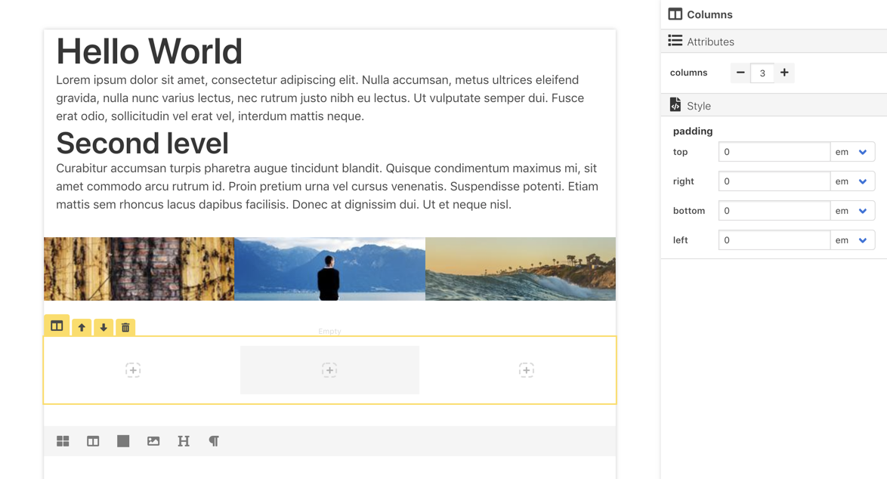

# block.js

> This project is WIP.

**Block.js** is a Block-Styled editor.



## Usage

Export json from visual editor of Block.js to **block.json**, and then use it in Vue component, for example:

```vue
<template>
  <div class="app">
    <Block :blocks="blocks" :data="data" />
  </div>
</template>

<script>
import { Block } from 'block.js'
import blockJSON from './blocks.json'

export default {
  components: {
    Block,
  },
  data() {
    return {
      blocks: blockJSON,
    }
  },
}
</script>
```
